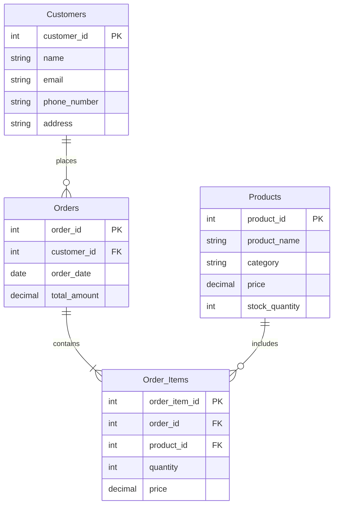

# E-Commerce Database Analysis Report

## 1. Schema Design

### Entity-Relationship Diagram



### Database connection

**cd into the folder**

```bash
cd altschool-exam\second semester\postgreSQL test
```

**Create a new database**
createdb new_database_name

**Restore the backup into the new database**

```bash
psql -U <your-username> -d <new_database_name> -f ecommerce_backup.sql
```

### Schema Explanation

The database consists of four main tables:

1. **Customers**: Stores customer information including contact details
2. **Products**: Contains product catalog with pricing and inventory
3. **Orders**: Tracks customer orders with dates and total amounts
4. **Order_Items**: Links orders to products with quantity and price details

## 2. Key Database Operations

### 2.1 CRUD Operations

#### Create (Insert) Operations

```sql
-- Insert new customer
INSERT INTO Customers (name, email, phone_number, address)
VALUES ('John Smith', 'john.smith@email.com', '(555) 123-4567', '123 Main St, Springfield, IL 62701');

-- Insert new product
INSERT INTO Products (product_name, category, price, stock_quantity)
VALUES ('Wireless Bluetooth Headphones', 'Electronics', 79.99, 150);

-- Create new order
INSERT INTO Orders (customer_id, order_date, total_amount)
VALUES (3, '2024-01-15', 104.49);

-- Create order_items
INSERT INTO Order_Items (order_id, product_id, quantity, price)
VALUES (1, 3, 2, 15.99);
```

#### Read (Select) Operations

```sql
-- RETRIVE ALL ORDERS MADE BY A SPECIFIC CUSTOMER
SELECT c.customer_id,
  c.name,
  p.product_name,
  p.category,
  p.price,
  oi.quantity,
  o.total_amount,
  o.order_date
FROM orders o
  JOIN customers c on o.customer_id = c.customer_id
  JOIN order_items oi ON oi.order_id = o.order_id
  LEFT JOIN products p ON p.product_id = oi.product_id
WHERE c.customer_id = 5;
```

#### Update Operations

```sql
-- Update customer details
WITH total_sold_quantity as (
  SELECT DISTINCT(product_id),
    sum(quantity) as quantity_sold,
    sum(price) as price_sold
  FROM order_items
  GROUP BY product_id
  ORDER BY product_id
)
UPDATE products
set stock_quantity = stock_quantity - ts.quantity_sold
FROM total_sold_quantity ts
WHERE products.product_id = 1;
```

#### Delete Operations

```sql
-- DELETE AN ORDER FROM THE DATABASE
DELETE from orders where order_id = 6;
```

### 2.2 Analytical Queries

#### Customer Analysis

```sql
-- Top 5 customers by spending
SELECT
    c.name,
    COUNT(DISTINCT o.order_id) as total_orders,
    ROUND(SUM(oi.quantity * oi.price), 2) as total_spent
FROM Customers c
JOIN Orders o ON c.customer_id = o.customer_id
JOIN Order_Items oi ON o.order_id = oi.order_id
GROUP BY c.customer_id, c.name
ORDER BY total_spent DESC
LIMIT 5;

-- Customer purchase frequency
SELECT
    c.name,
    COUNT(o.order_id) as order_count,
    ROUND(AVG(o.total_amount), 2) as avg_order_value
FROM Customers c
LEFT JOIN Orders o ON c.customer_id = o.customer_id
GROUP BY c.customer_id, c.name;
```

#### Product Analysis

```sql
-- Best-selling products
SELECT
    p.product_name,
    p.category,
    SUM(oi.quantity) as units_sold,
    ROUND(SUM(oi.quantity * oi.price), 2) as total_revenue
FROM Products p
JOIN Order_Items oi ON p.product_id = oi.product_id
GROUP BY p.product_id, p.product_name, p.category
ORDER BY units_sold DESC;

-- Product category performance
SELECT
    p.category,
    COUNT(DISTINCT p.product_id) as product_count,
    SUM(oi.quantity) as total_units_sold,
    ROUND(SUM(oi.quantity * oi.price), 2) as category_revenue
FROM Products p
LEFT JOIN Order_Items oi ON p.product_id = oi.product_id
GROUP BY p.category
ORDER BY category_revenue DESC;
```

## 3. Key Insights

### Customer Insights

1. **Purchase Patterns**

   - The Average order value across all customers was 2.
   - Most of the revenue was generated from the Ergonomic office chair.

2. **Customer Value**
   - Identification of high-value customers
     The high value customer on the platform was David Kim with a total purchase of 7 items purchased.
     John Smith was the customer with the most spent money on the platform, speding about $600 and he was also the only customer with a total revenue above $500.

### Product Insights

1. **Product Performance**

   - Top 3 Best selling products
     Organic Coffee Beans
     Gourmet Chocolate
     Fitness Tracker Watch
   - Product category best performance was in Food& Beverages

2. **Pricing Analysis**
   - Price point effectiveness
     4 products where priced above average at 82.48
     - Ergonomic office chair
     - Non_stick cookware set
     - Fitness tracker Watch
     - Leather Messenger bag
   - The total revenue generated from the platform was $3640.42

### Screenshots to the database queries

The screenshots to the queries can be found in
`postgresSQL test/altschool test`
